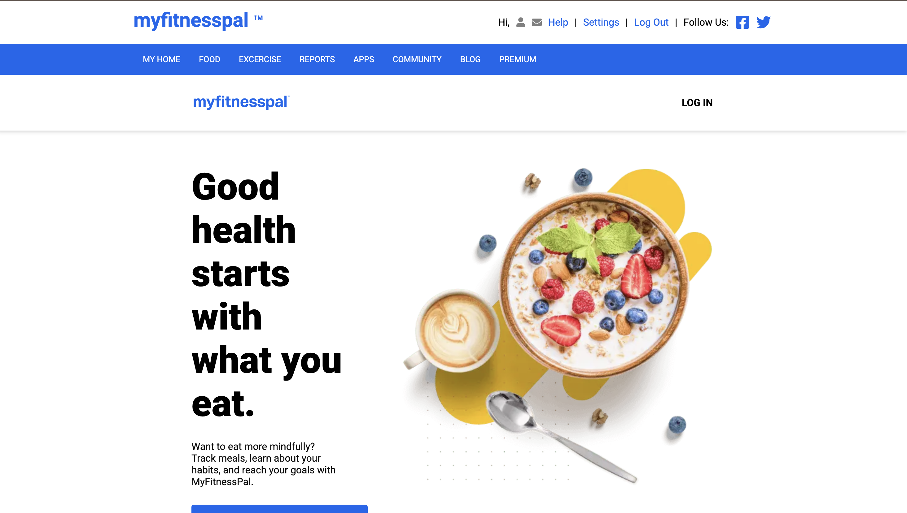
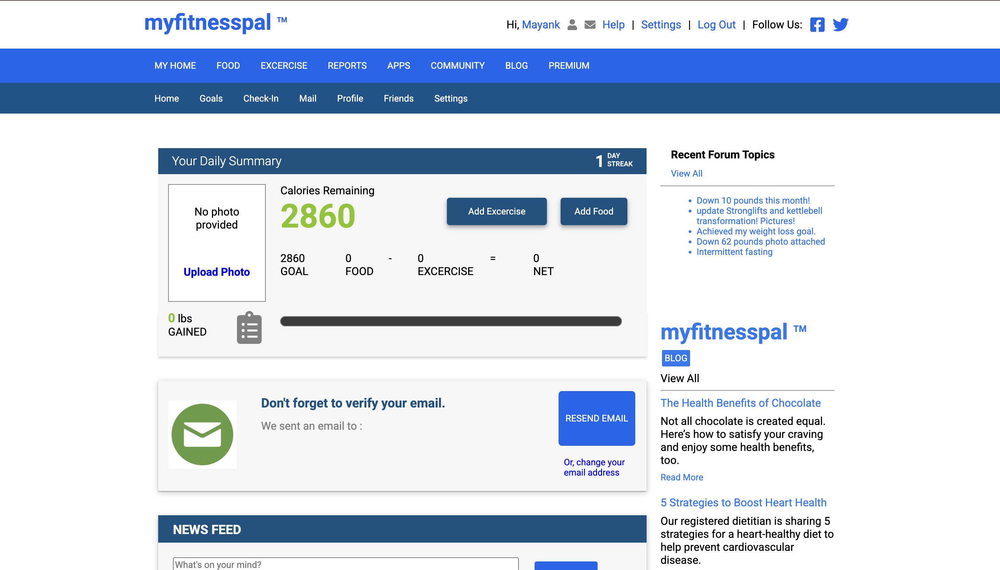
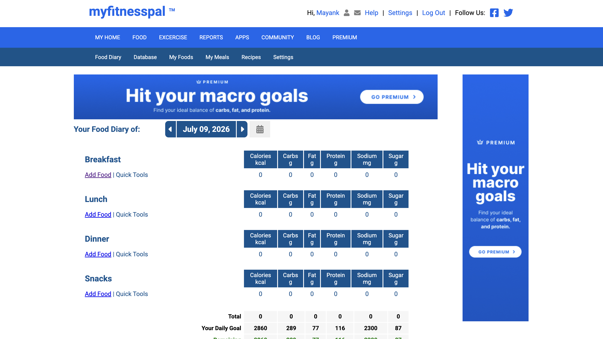
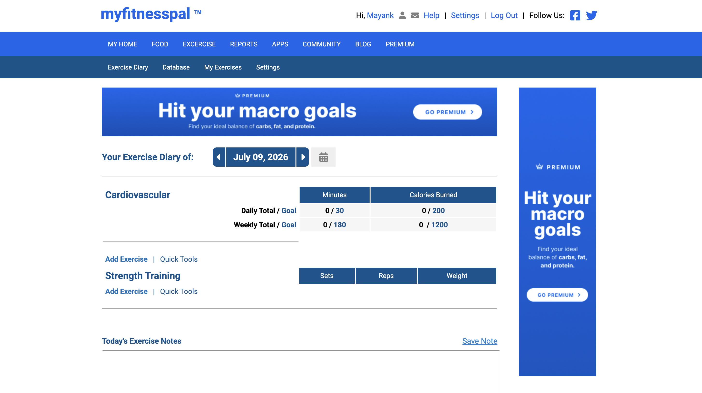
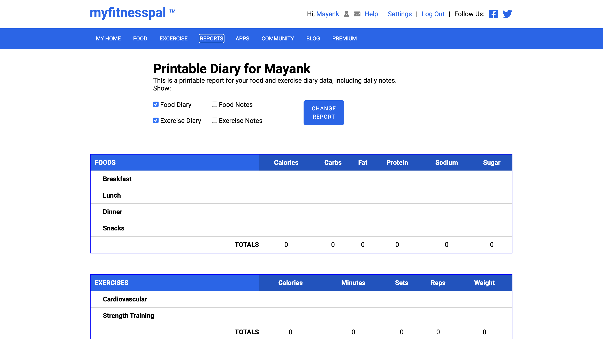

# 🥗 MyFitnessPal Clone

A responsive health and fitness management web application inspired by **MyFitnessPal**, designed to help users build healthier habits by tracking their daily nutrition and workouts. The application provides personalized calorie recommendations based on users' fitness goals and lifestyle, enabling them to monitor their progress and maintain a balanced routine.

---

## 📖 About the Project

**MyFitnessPal Clone** is a fitness tracking application that enables users to effectively manage their daily health and fitness activities. Users can register, receive personalized calorie goals based on their lifestyle and fitness objectives, and maintain detailed records of their meals and workouts.

The application features dedicated modules for food tracking, exercise tracking, printable reports, and health-related blogs, providing users with everything they need to stay consistent on their fitness journey. Built with **React.js** and **Redux**, the project follows a component-based architecture while using **JSON Server** as a mock backend to simulate REST APIs and persist application data.

---

## ✨ Features

- 👤 User Registration
- 🔥 Personalized Daily Calorie Requirement Generator
- 🥗 Food Diary for Tracking Daily Meals
- 💪 Exercise Diary for Tracking Workouts
- 📊 Real-time Calorie Counter
- 📈 Daily Nutrition Summary Dashboard
- 🖨️ Printable Diet & Exercise Reports
- 📰 Health & Fitness Blogs and Articles
- ⚡ Centralized State Management with Redux
- 📱 Responsive and User-Friendly Interface

---

## 🛠️ Tech Stack

| Category | Technologies |
|----------|--------------|
| **Frontend** | React.js |
| **State Management** | Redux, Redux Thunk |
| **Languages** | JavaScript (ES6), HTML5, CSS3 |
| **Backend (Mock API)** | JSON Server |
| **Routing** | React Router DOM |
| **Utilities** | React Datepicker, React Icons, React To Print, Swiper |

---

## ⚙️ Setup Instructions

### Prerequisites

Make sure you have the following installed:

- Node.js (v14 or above)
- npm

### 1. Clone the Repository

```bash
git clone https://github.com/mayanks09/Myfitnesspal.git
```

### 2. Navigate to the Project Directory

```bash
cd Myfitnesspal
```

### 3. Install Dependencies

```bash
npm install
```

### 4. Start the Mock Backend

Run the following command to start the JSON Server:

```bash
npm run server
```

The mock API will be available at:

```
http://localhost:8080
```

### 5. Start the React Application

Open a new terminal and run:

```bash
npm start
```

The application will be available at:

```
http://localhost:3000
```

> **Note:** Ensure both the React application and the JSON Server are running simultaneously for the application to function properly.

---

## 📸 Application Preview

### 🏠 Landing Page



---

### 📊 Dashboard



---

### 🥗 Food Diary



---

### 💪 Exercise Diary



---

### 🖨️ Printable Reports



---

### 📰 Blogs & Articles

